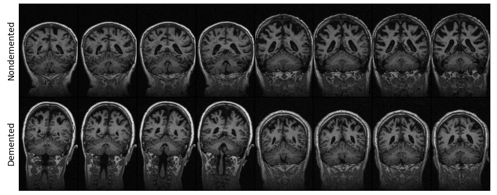

# Binary Classification for Dementia Diagnosis using OASIS-2

_Created for BMEN619_

This repository contains note books for the [development](./OAS-52-Model.ipynb) and [evaluation](./Prediction-Analysis.ipynb) of the OAS-52 RNN model for prediction Alzheimer's disease in MRI images.

**Open Access Series of Imaging Studies (OASIS): Longitudinal MRI Data in Nondemented and Demented Older Adults.** Marcus, DS, Fotenos, AF, Csernansky, JG, Morris, JC, Buckner, RL, 2010. Journal of Cognitive Neuroscience, 22, 2677-2684. doi: [10.1162/jocn.2009.21407](https://doi.org/10.1162/jocn.2009.21407)
